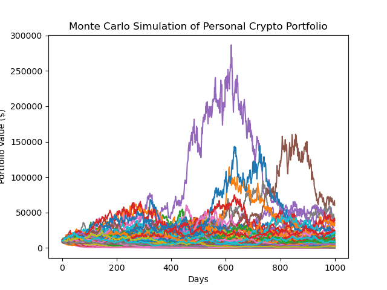

# *Crypto Query Lite - Crypto Analysis Tool* 
   
 

---
### *Necessary Library imports*
- import pandas as pd
- import datetime as dt
- import numpy as np
- import matplotlib.pyplot as plt
- import yfinance as yfin
- from re import L
- from numpy.ma.core import shape
- from matplotlib import style
- from pandas_datareader import data as pdr
- import questionary

### *User Story*

A crypto trader needs an analysis of potential returns on investment based on the historical performance of a coin. This analysis helps the trader determine what is the optimal investment portfolio.

### *Our Solution - Crypto Query Lite*

Our team created an analysis tool, *Crypto Query Lite*, that allows the user to view the possible outcomes in regards to their initial investment.

*Crypto Query Lite* uses a Monte Carlo Simulation to forecast future performance of a coin, the projection is based on the most recent year of daily prices as downloaded from Yahoo Finance via API.

The user can select:

- One coin: Bitcoin, Ethereum, Terra, Binance, Cardano.
- Initial investment amount
- Number of simulations (max 500)
- Number of days in the future (max 1000)

The code produces the following results: 
- Monte Carlo simulation graph
- Minimum
- Maximum
- STD (Standard Deviation)
- Mean
- 25% Quantile
- 50% Quantile
- 75% Quantile
- 95% CI Lower
- 95% CI Upper

Monte Carlo simulation graph example:

 

